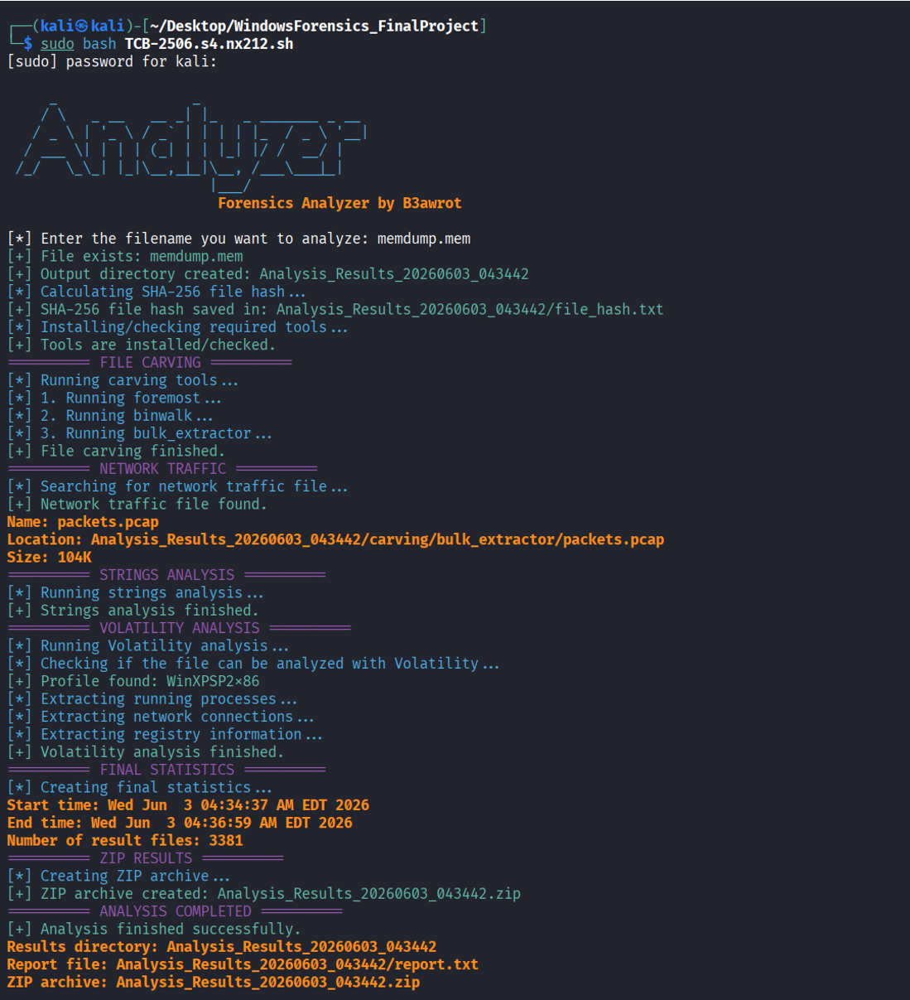
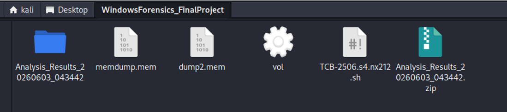
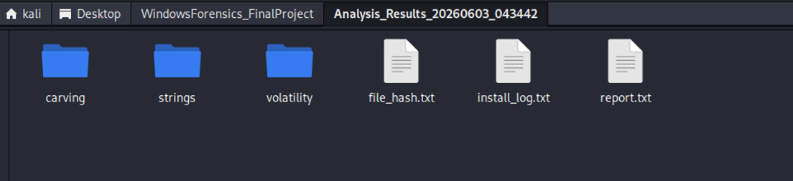
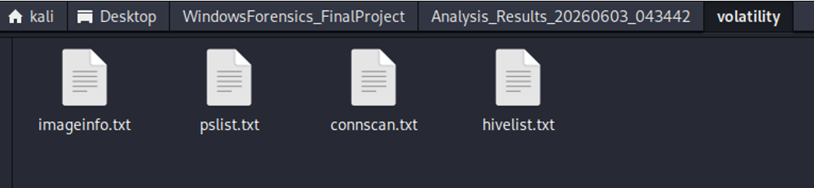

# Forensics Analyzer


## Overview


Forensics Analyzer is a Bash-based digital forensics automation project developed as part of my cybersecurity training.


The script automates several stages of disk and memory forensic analysis, including evidence hashing, file carving, artifact extraction, string analysis, network-related artifact discovery, Volatility memory analysis, report generation, and result archiving.


The project demonstrates practical skills in Bash scripting, digital forensics, forensic tool integration, memory analysis, artifact extraction, evidence integrity verification, and automated reporting.


> \*\*Important:\*\* This project was developed and tested in a controlled lab environment using forensic evidence files provided for training purposes.


---


## Features


Forensics Analyzer automates several stages of a forensic investigation:


- Accepts a disk or memory image for analysis

- Calculates a SHA-256 hash of the supplied evidence

- Performs file carving with Foremost

- Performs embedded-file analysis with Binwalk

- Extracts forensic artifacts with Bulk Extractor

- Searches extracted data for network-related information

- Extracts strings related to usernames and passwords

- Performs memory analysis using Volatility when applicable

- Extracts process, connection, and registry-related information from memory images

- Generates a consolidated forensic analysis report

- Archives the generated analysis results


---


## Workflow


The project follows the following high-level workflow:


```text

Forensic Image

     |

     v

Evidence Validation

     |

     v

SHA-256 Hash Calculation

     |

     v

Automated Forensic Analysis

     |

     +----> Foremost File Carving

     |

     +----> Binwalk Analysis

     |

     +----> Bulk Extractor

     |

     +----> Network Artifact Search

     |

     +----> String Extraction

     |

     +----> Volatility Memory Analysis

     |

     v

Generate Analysis Report

     |

     v

Archive Results

```


---


## Requirements


The script is designed for a Linux forensic analysis environment.


The project uses several command-line forensic tools, including:


- Bash

- `sha256sum`

- Foremost

- Binwalk

- Bulk Extractor

- Strings

- Volatility

- Standard Linux command-line utilities


Some analysis stages depend on the type of forensic image supplied and the availability of the required forensic tools.


---


## Usage


Run the script from a Linux system with the required forensic tools installed.


```bash

sudo bash src/forensics-analyzer.sh

```


The script will prompt for the forensic image that should be analyzed.


> The source script has been renamed to `forensics-analyzer.sh` for repository clarity. The original project report and screenshots may reference the original training filename `TCB-2506.s4.nx212.sh`.


---


## Evidence Integrity


Before performing forensic analysis, the script calculates a SHA-256 hash of the supplied image.


This provides a cryptographic identifier for the evidence being analyzed and demonstrates the use of hashing as part of a forensic workflow.


The calculated hash is included in the generated analysis results.


---


## File Carving


The analyzer uses multiple forensic utilities to extract and identify artifacts from the supplied image.


### Foremost


Foremost is used to perform file carving and recover files based on known file signatures.


### Binwalk


Binwalk is used to inspect the image for embedded files and recognizable data structures.


### Bulk Extractor


Bulk Extractor is used to extract forensic artifacts from the evidence without relying exclusively on the filesystem structure.


Using multiple tools demonstrates how different forensic utilities can be combined into a single automated analysis workflow.


---


## String and Network Artifact Analysis


The script searches the forensic evidence for security-relevant strings and network-related information.


The analysis includes extraction of strings associated with:


- Usernames

- Password-related data

- Network-related artifacts


Extracted results are stored in dedicated output files and referenced by the final analysis report.


> Extracted forensic artifacts may contain sensitive information. Generated analysis directories and forensic evidence files should not be committed to a public repository.


---


## Memory Analysis


When the supplied evidence is suitable for memory analysis, the script uses Volatility to collect information from the memory image.


The automated Volatility analysis includes operations for examining:


- Memory image information

- Running processes

- Network connections

- Registry hive information


These results provide additional context about system activity captured in memory.


---


## Reporting


The analyzer creates an organized analysis directory containing results generated by the individual forensic tools.


The final report consolidates information about the performed analysis and provides references to generated forensic artifacts.


The results can include:


- SHA-256 evidence hash

- Carved files

- Binwalk findings

- Bulk Extractor artifacts

- Extracted strings

- Network-related information

- Process information

- Network connection information

- Registry hive information


The completed analysis results are also archived for easier storage and review.


---


## Example Output

The following screenshots demonstrate the forensic analysis workflow and the generated output from an authorized lab environment.

### Automated Forensic Analysis

The analyzer processes the supplied memory image, calculates its SHA-256 hash, performs file carving, searches for network traffic artifacts, runs strings analysis, executes Volatility analysis, and generates the final results.



### Generated Analysis Results

After the analysis is completed, the tool creates a timestamped results directory and a ZIP archive containing the collected forensic artifacts.



### Output Structure

The generated results are organized into separate directories for file carving, strings analysis, and Volatility output, together with the file hash, installation log, and final report.



### Volatility Results

The Volatility analysis produces separate output files containing memory image information, running processes, network connection data, and registry hive information.




---


## Project Structure


```text

forensics-analyzer/

├── .gitattributes

├── .gitignore

├── README.md

├── src/

│   └── forensics-analyzer.sh

├── docs/

│   └── forensics-analyzer-report.pdf

└── images/

   └── forensics-analyzer-output.png

```


The `images/` directory is reserved for sanitized screenshots demonstrating the project output.


---


## Security & Privacy


Forensic evidence can contain significant amounts of sensitive information.


This repository therefore does not intentionally include:


- Disk or memory evidence images

- Extracted credentials

- Private keys

- Personal forensic artifacts

- Generated analysis directories

- Other sensitive evidence extracted during testing


The `.gitignore` file excludes common forensic image formats and generated analysis output to reduce the risk of accidentally committing evidence or analysis artifacts.


All screenshots should be sanitized before publication.


---


## Known Limitations


This project was developed as a cybersecurity training exercise and is intentionally limited in scope.


Current limitations include:


- Depends on external forensic command-line tools

- Some analysis stages depend on the supplied evidence type

- Volatility analysis depends on compatible memory images and profiles

- Results depend on the artifacts present in the forensic image

- String searches can produce false positives or irrelevant results

- The script does not replace manual forensic validation

- The project does not implement a complete forensic case-management workflow

- Analysis output may contain sensitive information and requires manual review before publication


---


## What I Learned


Through this project I practiced:


- Bash scripting

- Digital forensics workflow automation

- Evidence hashing with SHA-256

- File carving

- Foremost

- Binwalk

- Bulk Extractor

- String extraction and filtering

- Network artifact analysis

- Memory forensics

- Volatility

- Process analysis

- Network connection analysis

- Windows registry artifact analysis

- Integration of multiple forensic tools

- Automated report generation

- Result organization and archiving

- Handling sensitive forensic evidence

- Preparing forensic projects for public portfolio presentation


The project also demonstrated how multiple specialized forensic tools can be combined into a single automated workflow while preserving separate outputs for further manual investigation.


---


## Project Documentation


The original project report containing additional explanation and evidence of the lab implementation is available here:


[`docs/forensics-analyzer-report.pdf`](docs/forensics-analyzer-report.pdf)


The report preserves the original training-project documentation. As a result, the original script filename `TCB-2506.s4.nx212.sh` may appear in the report and its screenshots.


---


## Ethical Use


This project is intended for educational purposes and authorized digital forensic analysis.


Only analyze systems, images, memory captures, or other evidence that you own or have explicit authorization to examine.


Forensic evidence may contain confidential or personal information and should be handled appropriately.


---


## Project Status


*\*Completed training project\*\*


This repository preserves the project as completed during my cybersecurity training, with documentation, privacy safeguards, and repository organization added for portfolio presentation.

